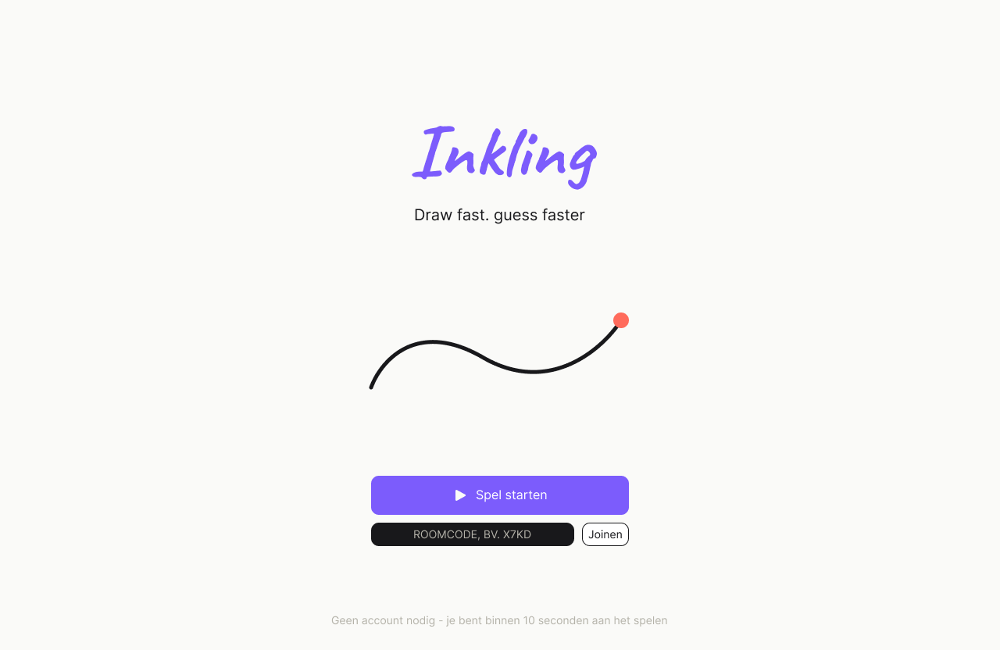
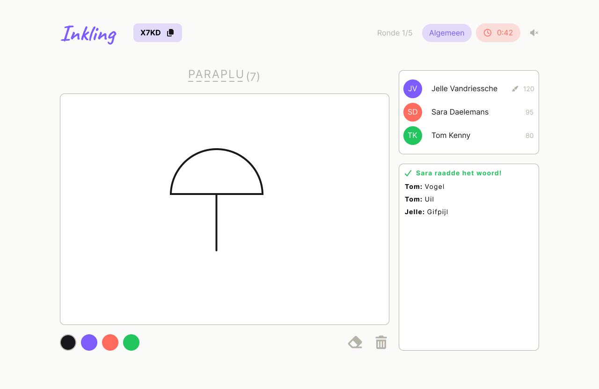
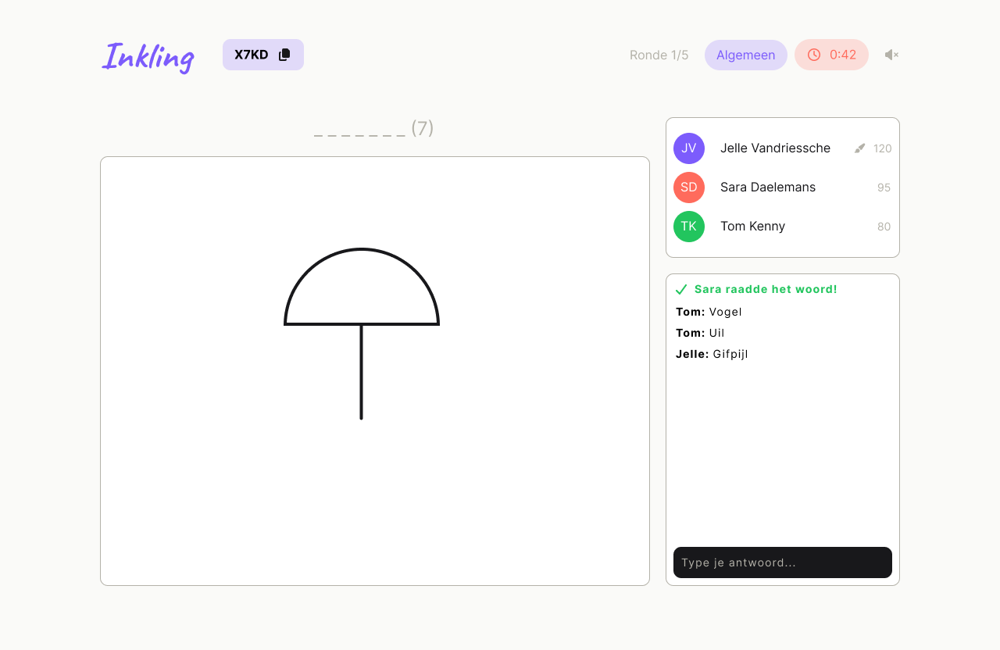
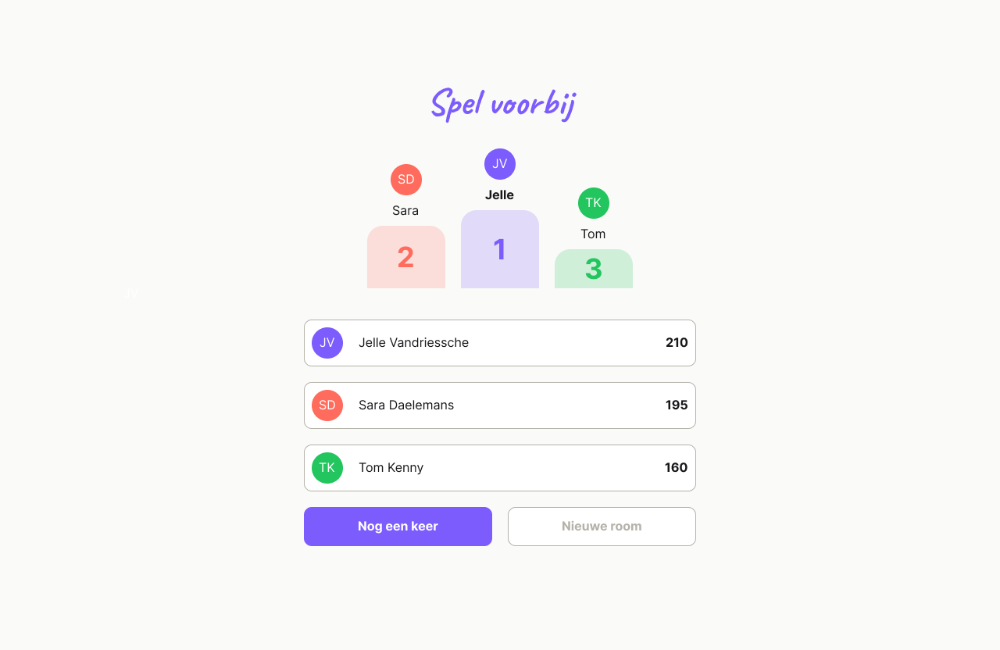

# Inkling

Multiplayer tekenspel voor de browser: één speler tekent een woord, de rest raadt live mee via chat terwijl de tekening ontstaat. Snelheid bepaalt de score. Gebouwd als sollicitatie-opdracht voor een full service marketingbureau — zie `CLAUDE.md` voor de volledige opdrachtcontext en het designsysteem.

## Live Demo

**[https://inkling-pi.vercel.app/](https://inkling-pi.vercel.app/)**

Inkling is een echt multiplayer spel — open de link in minstens twee tabs/apparaten om een room te maken en te joinen.

## Tech Stack

- **Frontend** — Next.js 16 (App Router), TypeScript, Tailwind CSS v4 met een eigen design-tokenset (`canvas`, `ink`, `primary`, `energy`, `success`, `error` + 6 vaste spelerskleuren), Inter (UI) en Caveat (handschrift-momenten) als fonts
- **UI-componenten** — `@base-ui/react`-primitives, shadcn-stijl opgebouwd (`Button`, `Input`, `Card`, `Badge`, `Avatar`) in `src/components/ui`
- **Backend/realtime** — Supabase: Postgres, Realtime (Broadcast + Postgres Changes), Edge Functions (Deno), Anonymous Auth, Row Level Security
- **Deployment** — Vercel

## Features

- Room aanmaken/joinen via een korte roomcode, anonieme sessie per browser (geen accounts)
- Profiel met naam en avatar in één van 6 vaste kleuren, roulerend toegewezen
- Instelbare spelinstellingen: aantal rondes (3–10), tijd per ronde (30–120 sec), woordcategorie
- Woordkeuze voor de tekenaar: 3 willekeurige woorden uit de gekozen categorie, met eerder in deze room gebruikte woorden expliciet uitgesloten zodat hetzelfde woord niet twee keer in dezelfde game terugkomt
- Eerlijke tekenvolgorde: bij het starten van het spel wordt de spelerslijst één keer geschud en vastgelegd — iedereen tekent gegarandeerd precies één keer voordat iemand een tweede beurt krijgt, ongeacht het aantal rondes
- Live samen tekenen op canvas: pointer-based tekenlogica, strokes gebatcht en gethrottled uitgezonden, en volledig resize-bestendig (bij een resize/orientation change wordt het canvas herbouwd vanuit de bewaarde strokes-array in plaats van te vertrouwen op canvas-pixels die bij een resize verloren gaan)
- Live meegokken via chat, met snelheidsscoring (lineair aflopend van 100 naar 20 punten) en een bonus voor de tekenaar per correcte gok
- Volledige rondecyclus: woord kiezen → tekenen → onthulling met scorebord → volgende ronde → eindstand
- Eindscherm met "Nog een keer" — herstart het spel (scores en rondes gereset) zonder dat spelers de room moeten verlaten
- Geluidseffecten (correcte gok, ronde-einde) met een persistente mute-knop
- Responsive layout met een eigen mobiele volgorde (canvas → chat → spelerslijst) onder 1024px, en een gecentreerde layout met naast-elkaar kolommen erboven
- De host kan pas starten vanaf 2 spelers, met duidelijke uitleg in de UI waarom de knop uitstaat

## Architecture

### Datamodel

```
rooms       → id, code, host_id, status, settings (jsonb: rounds, timePerRound, category, drawOrder), created_at
players     → id, room_id, auth_user_id, name, avatar_color, score, is_host, connected, joined_at, left_at
rounds      → id, room_id, round_number, drawer_id, status, started_at, ends_at, word_length
round_words → round_id, word
guesses     → id, round_id, player_id, guess_text, correct, points_awarded, guessed_at
words       → category, word
```

Plus een publieke view `word_categories` die enkel categorienamen teruggeeft, nooit de woorden zelf.

**Waarom het woord in een aparte tabel staat.** `rounds` wordt breed gelezen — élke speler in een room volgt via Realtime de status van de actieve ronde. Als het woord een kolom van `rounds` zou zijn, zou elke speler het woord samen met de rest van de rondedata binnenkrijgen, en zou het enkel via client-side logica verborgen worden — makkelijk te omzeilen via de browser-devtools (network tab of React state). Door het woord in een eigen tabel `round_words` te zetten met een RLS-policy die alleen de tekenaar van díe ronde leestoegang geeft, is de scheiding structureel: een rader kan het woord nooit ontvangen, ook niet door mee te lezen met het netwerkverkeer. Omdat `players.id` losstaat van de auth-sessie (`players.auth_user_id` is de link naar Supabase Auth), gaat die policy via een subquery/join op `auth_user_id`, niet via een directe vergelijking met `rounds.drawer_id`. Dezelfde scheiding geldt voor de volledige `words`-tabel: die heeft RLS zonder select-policy, dus enkel de service role (in de Edge Functions) kan de woordenlijst uitlezen — een speler kan nooit de volledige woordenbank vooraf opvragen.

### Realtime: drie mechanismen, drie verschillende garanties

- **Broadcast** — voor tekenstrokes (`round-{id}-strokes`) en chat/gokken (`round-{id}-chat`). Strokes zijn vluchtig en tijdgevoelig: laagste latency, geen DB-schrijflast nodig, en niets hoeft bewaard te blijven na de ronde. Punten worden genormaliseerd (0–1 t.o.v. canvas-afmeting) verstuurd zodat een tekenaar en een rader met een andere canvas-pixelgrootte (responsive layout) toch identiek uittekenen.
- **Postgres Changes** — voor alles wat consistent en betrouwbaar moet zijn omdat de database de bron van waarheid is: `rooms.status`, `rounds.status`/`round_number`, `players.score`, en player join/leave (`players` INSERT/UPDATE/DELETE, inclusief het soft-delete `left_at`-patroon voor verlaten/opnieuw-joinen). Score-updates die een Edge Function server-side doorvoert, komen zo bij iedereen automatisch binnen zonder polling.
- **Presence** — bewust **niet** gebruikt, ondanks dat het oorspronkelijk in de architectuurkeuze stond als het voor-de-hand-liggende mechanisme voor "wie is online". Spelersaanwezigheid (join/leave, host-status) moest de refresh en een herverbinding overleven, en dat is precies wat een puur ephemeral presence-kanaal niet doet — die state verdwijnt zodra de socket wegvalt. Door join/leave in plaats daarvan als persistente rijen in `players` te modelleren (met `left_at` als soft-delete) en te synchroniseren via Postgres Changes, blijft de spelerslijst correct ook na een refresh, tab-crash of tijdelijke disconnect.

### Edge Functions

Drie Deno Edge Functions, elk met de service role key (omzeilt RLS, dus alle autorisatie gebeurt expliciet in code):

- **`get-word-choices`** — geeft de tekenaar 3 willekeurige woorden uit de gekozen categorie. Controleert eerst zelf of de aanroeper daadwerkelijk de tekenaar van déze ronde is (via de meegestuurde JWT vergeleken met `players.auth_user_id`), en sluit vervolgens woorden uit die deze room al eerder in het huidige spel gebruikt heeft (join van `round_words` op `rounds.room_id`), zodat hetzelfde woord niet twee keer valt.
- **`submit-guess`** — valideert dat de ronde nog gokken accepteert, dat de aanroeper geen tekenaar is, en vergelijkt de gok case-insensitive met het woord uit `round_words`. Bij een correcte gok wordt de score server-side berekend op basis van `rounds.started_at`/`ends_at` en de servertijd van het moment van gokken (nooit op basis van een door de client opgegeven verstreken tijd), en wordt automatisch nagegaan of iedereen al geraden heeft om de ronde vroegtijdig naar `reveal` te zetten.
- **`get-round-word`** — geeft het woord pas vrij zodra `rounds.status` echt op `reveal` staat, voor het onthullingsscherm.

**Waarom dit server-side moet.** Scoring en woordselectie zijn de twee plekken waar een gemanipuleerde client rechtstreeks financieel voordeel (lees: punten) zou kunnen behalen als de logica client-side stond: een aangepaste client zou zichzelf willekeurige scores kunnen toekennen, of het woord kunnen opvragen zonder de bijbehorende RLS-restrictie te respecteren. Door woordselectie en scoring uitsluitend in Edge Functions met de service role key te laten lopen, is er precies één plek die deze twee dingen mag doen, en die plek controleert zelf expliciet wie de aanroeper is en wat die aanroeper op dit moment mag — in plaats van te vertrouwen op wat de client beweert.

## Design decisions

**Why Supabase?** Dit project heeft niet zomaar "een database" nodig, maar specifiek de combinatie Postgres + RLS + Realtime + Edge Functions in één platform: RLS is wat het woord-geheimhoudingsprobleem structureel oplost (zie hierboven), Realtime (Broadcast + Postgres Changes) levert de live tekenen/gokken-ervaring zonder een aparte WebSocket-server te moeten bouwen, en Edge Functions geven een plek voor server-side scoring zonder een los backend-project op te zetten. Anonymous Auth tenslotte geeft elke speler een stabiele `auth.uid()` (nodig voor de RLS-policies) zonder dat spelers een account hoeven aan te maken voor een los potje tekenen.

**Why Next.js?** App Router + TypeScript geeft één deployable dat rechtstreeks op Vercel draait, met server- en clientcomponenten waar dat past (bv. Edge Function-aanroepen vanuit clientcomponenten, statische schermen als server components). Dit matcht ook de door de opdrachtgever gevraagde stack.

**Why Canvas?** Freehand tekenen vraagt om ruwe pixelcontrole bij hoge frequentie (elke `pointermove`), en SVG zou bij een volledige tekenronde al snel honderden losse `<path>`-elementen in de DOM opbouwen. Met een `<canvas>` blijft het geheugengebruik en de renderkost constant ongeacht hoe lang er getekend wordt. Strokes worden genormaliseerd (0–1) verstuurd i.p.v. in ruwe pixels, zodat tekenaar en raders met elk hun eigen canvas-pixelgrootte (responsive) toch identiek uittekenen — en diezelfde bewaarde strokes-array is ook precies wat een resize-bestendige herbouw van het canvas mogelijk maakt (zie Features).

### Visuele identiteit


*Landing — wordmark in Caveat, primaire call-to-action om een room te maken of te joinen.*


*Tekenscherm voor de tekenaar — het volledige woord zichtbaar boven het canvas, tekentools eronder.*


*Zelfde scherm voor de raders — het woord toont enkel de blanks, met de live chat/gokkenlijst en spelerslijst in de zijbalk.*


*Eindstand — volledige ranking met scores, en de optie om via "Nog een keer" een nieuwe game in dezelfde room te starten.*

## AI usage

Dit project is gebouwd met Claude Code als uitvoerende partner, niet als architect. Concreet:

- **Scaffolding** — herbruikbare componenten (avatar, roomcode-badge, score-rij, kaart) en de schermen die ze combineren zijn met Claude Code opgezet, component-first zoals beschreven in `CLAUDE.md`.
- **RLS-policies debuggen** — met name de policy op `rounds`/`round_words` die het woord alleen voor de tekenaar leesbaar maakt, is iteratief met Claude Code getest en bijgeschaafd (de `auth_user_id`-vs-`players.id`-valkuil, en de join/subquery die daaruit volgt) tot de policy zowel correct afsloot voor raders als werkte voor de tekenaar zelf.
- **Edge Functions opzetten** — de Deno-boilerplate (CORS-headers, JWT-verificatie, service-role-client, `EdgeRuntime.waitUntil` voor niet-blokkerende score-writes) voor `get-word-choices`, `submit-guess` en `get-round-word` is met Claude Code geschreven en getest.
- **Iteratieve UI-fixes op basis van screenshots/gedrag** — responsive layoutproblemen (canvas die op mobiel te klein werd, een chatbox zonder hoogtelimiet, een gokveld dat niet met de Enter-toets werkte op mobiel) zijn stap voor stap opgelost door het gedrag te beschrijven en de fix te laten toepassen.

**Wat bewust door mij is beslist, niet door AI:** het datamodel (welke tabellen, welke kolommen, en specifiek de keuze om `round_words` los te trekken van `rounds`), de RLS-scheiding tussen woord en rondedata, en welk van de drie Realtime-mechanismen voor welk stukje state gebruikt wordt (en de bewuste keuze om Presence dus juist *niet* te gebruiken). Claude Code heeft die keuzes uitgevoerd en de details ingevuld, niet bedacht.

## What I would improve

- **Geen tekengeschiedenis bij laat joinen.** Strokes worden alleen live gebroadcast, niet bewaard — een speler die halverwege een tekening joint (of ververst) ziet een leeg canvas totdat de tekenaar weer begint te tekenen, in plaats van wat er al staat.
- **Rondes < spelers = niet iedereen tekent.** De eerlijke-rotatielogica garandeert dat niemand *twee keer* tekent voordat iedereen een beurt heeft gehad, maar als de host minder rondes instelt dan er spelers zijn, komt niet elke speler binnen die game aan de beurt.
- **Geen replay-galerij.** Het datamodel liet dit bewust toe voor later (een `drawings`-tabel met een snapshot per ronde), maar die is er in v1 nog niet — getekende rondes zijn na afloop nergens meer te bekijken.
- **Framer Motion is een dependency, maar wordt nog niet gebruikt** — animaties/transities lopen momenteel volledig via Tailwind (`transition-colors`, `transition-all`). De speelse micro-interacties die Framer Motion zou toevoegen (bv. bij het onthullen van het woord, of een score die oploopt) ontbreken nog.
- **`players.connected` wordt nooit bijgewerkt** na de initiële insert — er is dus geen echte live "is deze speler nog verbonden"-indicator, enkel het grovere join/leave via `left_at`.
- **Schema en RLS-policies staan niet als versiebeheerde SQL-migraties in deze repo** — ze zijn rechtstreeks via de Supabase SQL-editor opgezet. Voor een groter of langer lopend project zou dit met `supabase migration`-bestanden moeten, zodat het schema reproduceerbaar en reviewbaar is.

## Running locally

1. **Clone en installeer**
   ```bash
   git clone https://github.com/jellev00/inkling.git
   cd inkling
   npm install
   ```

2. **Supabase-project** — maak een project aan op [supabase.com](https://supabase.com) en zet Anonymous sign-ins aan (Authentication → Providers → Anonymous).

3. **Schema en RLS** — maak in de SQL-editor van dat project de tabellen aan zoals hierboven onder [Architecture](#architecture) beschreven (`rooms`, `players`, `rounds`, `round_words`, `guesses`, `words`), plus de view `word_categories`. Zet RLS aan op alle tabellen, met als belangrijkste policy: `rounds`/`round_words` mogen enkel volledig gelezen worden door de speler wiens `auth_user_id` overeenkomt met de `drawer_id` van die ronde; `words` heeft geen select-policy voor de `anon`-rol.

4. **Environment variables** — maak `.env.local` aan in de projectroot:
   ```
   NEXT_PUBLIC_SUPABASE_URL=https://<project-ref>.supabase.co
   NEXT_PUBLIC_SUPABASE_ANON_KEY=<anon-key>
   ```

5. **Edge Functions deployen** (Supabase CLI, `supabase link` naar je project):
   ```bash
   supabase functions deploy get-word-choices
   supabase functions deploy submit-guess
   supabase functions deploy get-round-word
   ```
   Deze functies gebruiken de service role key server-side — die staat automatisch beschikbaar binnen Supabase Edge Functions (`SUPABASE_SERVICE_ROLE_KEY`), er is geen aparte secret-configuratie voor nodig.

6. **Dev-server**
   ```bash
   npm run dev
   ```
   Open [http://localhost:3000](http://localhost:3000) — maak een room aan in één tab en join in een tweede tab om multiplayer lokaal te testen.
